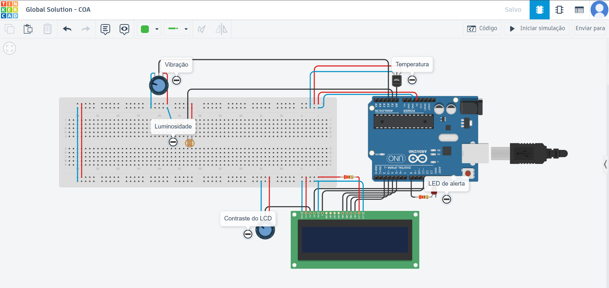
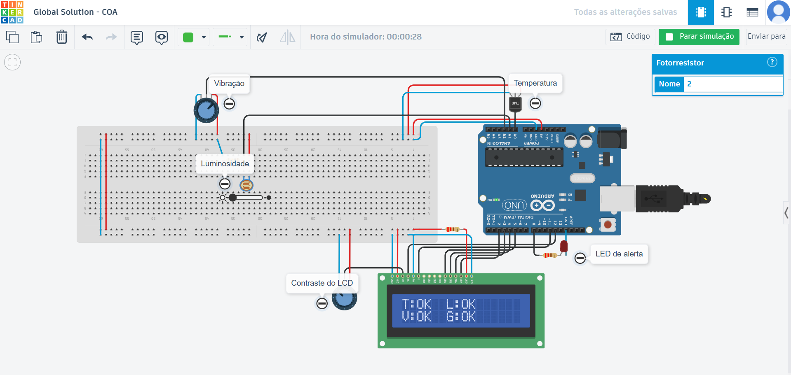
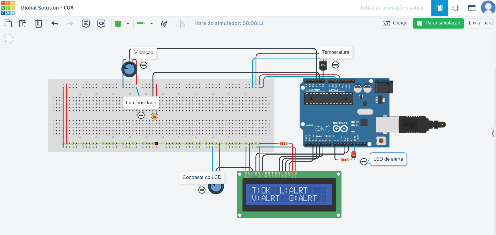

# Mission Control AI — Cápsula Espacial IoT (COA)


Sistema IoT simulado no **Tinkercad** para **telemetria** e **monitoramento em tempo real** das condições internas de uma cápsula espacial, utilizando **Arduino Uno**, **LCD 16x2** e **alertas visuais**.

---

## Visão Geral

Este projeto implementa um protótipo de **sistema embarcado** voltado ao cenário de uma missão espacial simulada. O objetivo é acompanhar continuamente variáveis essenciais de operação e segurança:

-  **Temperatura** (sensor **TMP36**)
-  **Luminosidade** (LDR + divisor de tensão)
-  **Vibração** (**simulada** por potenciômetro)

Os dados são exibidos no **LCD 16x2** em duas telas alternadas, e um **LED de alerta** é acionado sempre que qualquer variável ultrapassa o limite definido.

---

## Demonstração

| Item | Link |
| --- | --- |
| Simulação (Tinkercad) | https://www.tinkercad.com/things/7ZBku7a92Tj-global-solution-coa?sharecode=Ag-auWkIeHudWy2uvOhL03sFWdusYM7DWpYb_4HR0Iw |
| Vídeo (YouTube) | https://youtu.be/1qs2sT09RGM |
| Repositório (GitHub) | https://github.com/gabrielbfurin/COA-Global_Solution-2026 |

---

## Objetivo

Desenvolver um sistema IoT/embarcado capaz de:

1. **Ler sensores** (entradas analógicas) continuamente;
2. **Processar** os dados (conversões e normalizações);
3. **Comparar com limites (thresholds)** para classificar o estado;
4. **Exibir telemetria e status** no LCD 16x2;
5. **Acionar alerta visual** via LED quando houver condição de risco.

Padronização de status:
- **OK**: variável dentro do limite.
- **ALRT**: variável fora do limite (estado de alerta).

---

## Componentes Utilizados

### Hardware (simulação)

- **Arduino Uno**
- **Protoboard** + jumpers
- **LCD 16x2** (modo 4 bits)
- **TMP36** (temperatura)
- **LDR (fotoresistor)** + **resistor 10kΩ** (luminosidade via divisor de tensão)
- **Potenciômetro 10kΩ** (contraste do LCD)
- **Potenciômetro** (simulação de vibração)
- **LED** + **resistor ~220Ω** (alerta)

### Observação sobre a vibração (simulada)

A **vibração** foi representada por um **potenciômetro** como equivalente simulado (em vez de um sensor real como piezoelétrico/acelerômetro). O objetivo é validar o fluxo do sistema: **leitura → processamento → alerta → exibição**.

---

## Funcionamento do Sistema

O sistema executa um ciclo contínuo (loop) de telemetria:

1. **Aquisição**: lê os pinos analógicos **A0, A1, A2**.
2. **Processamento**:
   - Converte a leitura do **TMP36** para °C.
   - Interpreta a luminosidade via valor do divisor de tensão (LDR).
   - Normaliza o “nível de vibração” (0..1023) para uso como intensidade.
3. **Classificação**: compara cada variável com seus limites e determina **OK** ou **ALRT**.
4. **Interface**:
   - **LCD** alterna entre 2 telas com informações de telemetria e diagnóstico.
   - **LED de alerta** acende quando existe alerta em qualquer sensor.

---

## Lógica de Monitoramento e Alertas

### 1) Leitura dos sensores

| Variável | Componente | Pino |
| --- | --- | --- |
| Temperatura | TMP36 | A0 |
| Luminosidade | LDR + divisor | A1 |
| Vibração (simulada) | Potenciômetro | A2 |

### 2) Processamento dos dados

- **TMP36 → °C**: `tempC = (V - 0.5) * 100`
- **Luminosidade**: leitura analógica do nó do divisor (0..1023)
- **Vibração**: escala analógica (0..1023), utilizada como “intensidade”

### 3) Comparação com limites (thresholds)

| Variável | Condição de alerta |
| --- | --- |
| Temperatura | **>= 30°C** |
| Luminosidade | **<= 150** (quanto menor, mais escuro) |
| Vibração | **>= 700** |

### 4) Exibição no LCD

- **Tela 1**: telemetria (valores) + status geral (**G: OK/ALRT**)
- **Tela 2**: diagnóstico compacto por sensor (**T/L/V**) + status geral

### 5) Acionamento do LED

- O **LED** (pino digital 8) acende quando:
  - `alertaGeral = alertaTemp OR alertaLuz OR alertaVib`

---

## Evidências

> As imagens abaixo demonstram o circuito e o sistema em operação nos cenários **OK** e **ALRT**.

### 1) Circuito completo

Imagem do circuito montado no Tinkercad com Arduino Uno, LCD 16x2, sensores e LED de alerta.



### 2) Sistema em operação — Status **OK**

LCD exibindo diagnóstico com todas as variáveis dentro do limite (**OK**).



### 3) Sistema em operação — Status **ALRT**

LCD exibindo **ALRT** quando pelo menos uma variável ultrapassa o limite configurado (alerta geral ativo).



---

## Como Executar (no Tinkercad)

1. Acesse o link da simulação (seção **Demonstração**).
2. Clique em **Iniciar simulação**.
3. Teste os cenários:
   -  Aumente/diminua a temperatura do **TMP36**.
   -  Ajuste a luz do **LDR** para simular claro/escuro.
   -  Gire o potenciômetro de **vibração** para simular níveis maiores.
4. Observe:
   - Atualização da **telemetria** no LCD.
   - Status **OK/ALRT** por sensor e status geral.
   - **LED de alerta** acendendo quando houver condição crítica.

---

## Estrutura do Repositório

```text
COA-Global_Solution-2026/
├─ README.md
├─ src/
│  └─ mission_control_capsula.ino
└─ docs/
   ├─ relatorio.pdf
   └─ img/
      ├─ circuito_completo.png
      ├─ status_ok.png
      └─ status_alerta.png
```

---

## Possíveis melhorias futuras

- Adicionar **buzzer** para alerta sonoro.
- Armazenar histórico de leituras (ex.: EEPROM / log serial estruturado).
- Substituir a vibração simulada por sensor real (piezo/MPU6050) em protótipo físico.
- Criar um dashboard externo (PC) consumindo dados via Serial.

---

## Integrantes

- **Gabriel Barbosa Furin** — RM: **572941**
- **Lucas Kiodi Moraca** — RM: **571004**
- **Renan Fracalossi Mano da Silva** — RM: **569610**

---

## Informações Acadêmicas

- **Turma:** 1CCPX
- **Projeto:** Global Solution 2026 — 1º semestre
- **Disciplina:** COA
- **Tema:** Sistema IoT para Monitoramento de Cápsula Espacial
